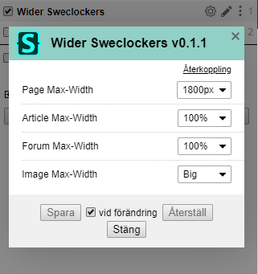

# Wider-Sweclockers

Make www.sweclockers.com wider

A userCSS for [Sweclockers.com](https://sweclockers.com)

Install Stylus in you browser and then press the link below

[Install Wider Sweclockers](https://raw.githubusercontent.com/rlagers/Wider-Sweclockers/main/wider-sweclockers.user.styl)

Config look like this:

